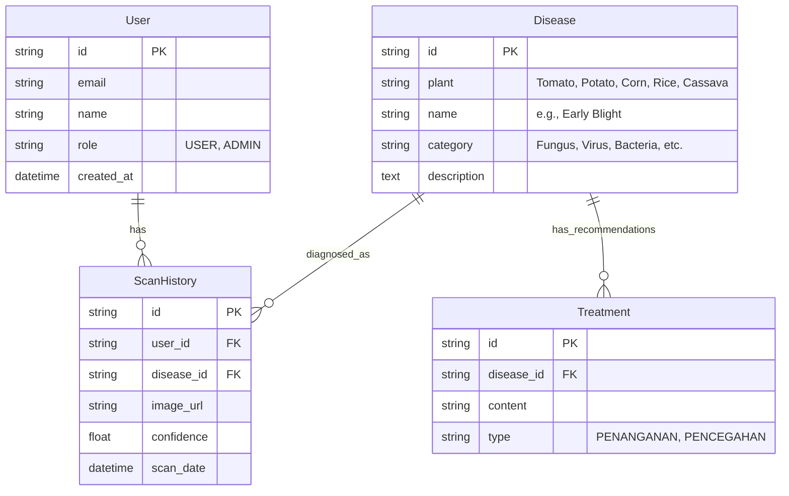
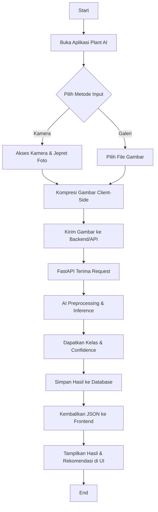
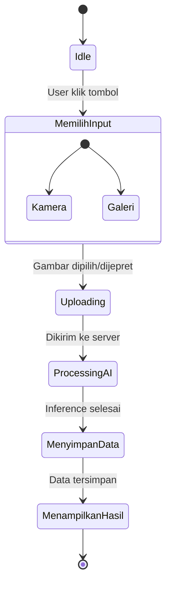

# Plant Disease AI Detector - Architecture & Diagrams

## 1. Entity Relationship Diagram (ERD)



## 2. Use Case Diagram

```mermaid
usecaseDiagram
    actor User as "Pengguna"
    actor Admin as "Administrator"
    actor AI as "AI Inference Engine"

    User --> (Ambil Foto Kamera)
    User --> (Unggah Foto Galeri)
    User --> (Lihat Hasil Deteksi)
    User --> (Lihat Riwayat Pemindaian)
    User --> (Lihat Rekomendasi Penanganan)
    
    (Ambil Foto Kamera) ..> (Kirim ke API) : include
    (Unggah Foto Galeri) ..> (Kirim ke API) : include
    
    (Kirim ke API) --> AI
    AI --> (Prediksi Penyakit & Confidence)
    
    Admin --> (Kelola Data Penyakit)
    Admin --> (Kelola Rekomendasi)
    Admin --> (Lihat Statistik Sistem)
    Admin --> (Lihat Seluruh Riwayat)
```

## 3. Flowchart Sistem



## 4. Activity Diagram (Proses Deteksi)


